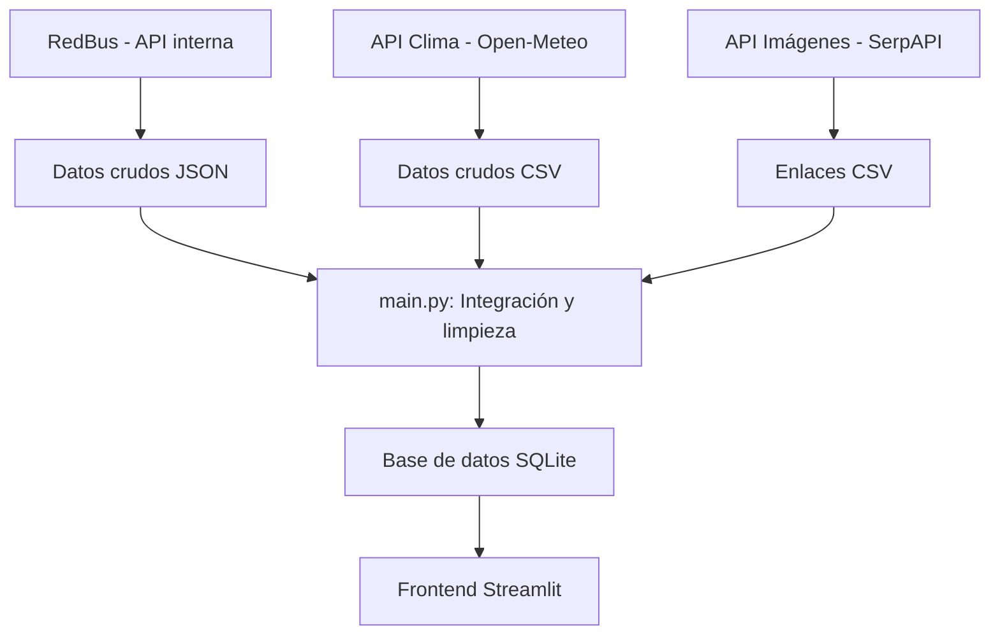

# 🚌 Chaskiway: Recomendador de Viajes Económicos por el Perú

**Chaskiway** es una aplicación web colaborativa desarrollada para el curso de Lenguaje de Programación 2. Su objetivo es ayudar a los usuarios a planificar viajes interprovinciales desde Lima, recomendando las mejores opciones según presupuesto, clima y calidad del servicio, integrando datos de múltiples fuentes reales.

---

## 🎯 Objetivo del Proyecto

Desarrollar una solución completa de extracción, integración y visualización de datos de viajes, aplicando técnicas de scraping, consumo de APIs, procesamiento y visualización interactiva.

### Objetivos Específicos
- **Recolectar** información de pasajes, clima e imágenes de al menos tres fuentes distintas.
- **Integrar** los datos en una base centralizada y limpia.
- **Desarrollar** un sistema de recomendación personalizado.
- **Presentar** los resultados en una interfaz web moderna y visual.

---

## 🏗️ Arquitectura y Flujo de Datos



### Flujo del Sistema

1. **Extracción:**  
   - [`backend/scraping/redbus`](backend/scraping/redbus/): Extrae datos de viajes desde la API interna de RedBus (identificada por inspección de red).
   - [`backend/scraping/clima`](backend/scraping/clima/): Descarga y procesa datos de clima desde la API pública de Open-Meteo.
   - [`backend/scraping/imagenes`](backend/scraping/imagenes/): Obtiene enlaces de imágenes de la API de SerpAPI.

2. **Integración:**  
   - [`main.py`](main.py) orquesta la limpieza y combinación de los datos, generando la base de datos final en `data/processed/viajes_grupales.db`.

3. **Presentación:**  
   - [`frontend/app.py`](frontend/app.py) consume la base de datos y presenta recomendaciones y visualizaciones interactivas.

---

## 📚 Estructura del Proyecto

```
Viajes-Economicos-Chaskiway/
│
├── backend/
│   ├── scraping/         # Scrapers de RedBus, clima e imágenes
│   │   ├── redbus/      # Scraper RedBus
│   │   ├── clima/       # Scraper Clima
│   │   └── imagenes/    # Scraper Imágenes
│   └── database/        # Esquema y carga de la base de datos
│
├── data/
│   ├── raw/             # Datos crudos extraídos de las fuentes
│   └── processed/       # Datos integrados y base de datos final
│
├── frontend/            # Interfaz web en Streamlit
│
├── utils/               # Utilidades de validación y logging
│
├── main.py              # Pipeline de integración de datos
├── requirements.txt     # Dependencias del proyecto
├── README.md            # Este archivo
└── docs/                # Documentación y presentaciones
```

---

## 🧑‍💻 Equipo de Desarrollo

| Integrante | Usuario de GitHub | Rol en el Proyecto |
|:-----------|:------------------|:-------------------|
| **Jhon Jhayro Villegas Verde** | `JhoJha` | Backend, Scraper de RedBus y Base de Datos |
| **Jonnathan Jesús Pedraza Laboriano** | `jonnathan2023` | Backend, Scraper de Imágenes y Frontend |
| **David Ojeda Valdiviezo** | `20210842` | Backend, Scraper de Clima y Dashboard |

---

## 🔑 Fuentes de Información

1. **RedBus:**  
   - Se utilizó la **API interna** identificada mediante inspección de red, permitiendo obtener datos estructurados de viajes (precios, horarios, empresas, asientos, ratings) de forma eficiente y robusta.

2. **API de Clima (Open-Meteo):**  
   - Provee datos históricos y de pronóstico para cada destino, sin requerir autenticación.

3. **API de Imágenes (SerpAPI):**  
   - Suministra imágenes representativas de alta calidad para cada destino usando Google Images.

---

## 🚀 Ejecución Paso a Paso

### 1. Instala dependencias y configura el entorno

```bash
git clone https://github.com/JhoJha/Viajes-Economicos-Chaskiway.git
cd Viajes-Economicos-Chaskiway
python -m venv venv
source venv/bin/activate  # o .\venv\Scripts\activate en Windows
pip install -r requirements.txt
```

### 2. Configura las API keys

- Crea un archivo `.env` siguiendo el ejemplo en [`docs/API_KEYS.md`](docs/API_KEYS.md).
- Solo es necesaria la key de SerpAPI para imágenes.

### 3. Ejecuta los scrapers

```bash
python backend/scraping/redbus/run_scraper.py
python backend/scraping/clima/scraper.py
python backend/scraping/clima/procesador.py
python backend/scraping/imagenes/scraper.py
```

### 4. Ejecuta el pipeline de integración

```bash
python main.py
```
- Si falta algún archivo crítico, el pipeline te avisará y se detendrá.

### 5. Levanta el frontend

```bash
streamlit run frontend/app.py
```

---

## 🛠️ Dificultades Encontradas y Soluciones

- **Integración de datos heterogéneos:**  
  Se normalizaron nombres y formatos para combinar fuentes distintas.

- **Límites de APIs y manejo de claves:**  
  Se gestionaron claves con variables de entorno y manejo de errores.

- **Scraping de RedBus:**  
  Se identificó y utilizó la API interna mediante inspección de red, evitando el scraping HTML tradicional.

- **Colaboración y control de versiones:**  
  Se definió una estrategia de ramas y uso de Pull Requests para evitar conflictos.

---

## 📄 Documentación Adicional

- Cada carpeta principal y de scrapers incluye su propio `README.md` explicativo.
- Consulta [`docs/API_KEYS.md`](docs/API_KEYS.md) para la gestión de claves.
- Detalles cooperativos y colectivos del trabajo en [`Informe_Colaborativo.ipynb`](Informe_Colaborativo.ipynb).

---

## 📬 Contacto

Para más información, contactar a: `20231515@lamolina.edu.pe`, `20231505@lamolina.edu.pe`, `20210842@lamolina.edu.pe`
